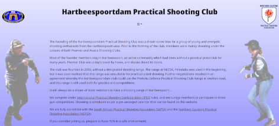

# HPSC website

## Table of Contents
- [Description](#description)
- [Summary](#summary)
- [Repository](#repository)
- [Structure](#structure)
- [Technology](#technology)
- [Instructions](#instructions)
- [Screenshots](#screenshots)
- [License](#license)
- [Author](#author)

## Description
This repository contains the source code for the Hartbeespoortdam Practical Shooting Club (HPSC) website.

## Summary
The [HPSC website](https://hpsc.co.za) uses modern web technologies 
to provide an informative and user-friendly platform for members and visitors.<br/> 
The primary technologies used in this project include TypeScript, SCSS, and MDX.

## Repository
The repository for this project is located at 
[GitHub](https://github.com/tahoni/hpsc-web-vite).

Feature requests, suggestions for improvements and bugs can be 
logged using the project's [Issues](https://github.com/tahoni/hpsc-web-vite/issues) page.

An overview of the project can be found at 
[https://tahoni.info/projects/hpsc-web-vite](https://www.tahoni.info/projects/hpsc-web-vite).

## Structure
A high-level structure of the project.
```text
├───documentation
│   └───screenshots
├───public
│   └───assets
│       └───images
│           └───logos
└───src
    ├───assets
    │   ├───fonts
    │   ├───images
    │   │   ├───icons
    │   │   └───ids
    │   └───stylesheets
    ├───components
    ├───constants
    ├───content
    │   ├───pages
    │   └───posts
    ├───forms
    ├───layout
    │   ├───Body
    │   ├───Content
    │   ├───Footer
    │   └───Header
    ├───model
    ├───pages
    ├───services
    └───utils
```

## Technology

### Overview

This is a React project bootstrapped using Vite with the TypeScript React template.

It is written in TypeScript and uses both JSX and MDX components.

Bootstrap and React Bootstrap are used for the UI/UX.<br/>
Styling is done by SCSS stylesheets.

React Router is used for page routing.

### Technology Stack

#### Languages:

- TypeScript 5

  [](https://www.typescriptlang.org/)

- HTML 5

  [](https://www.w3.org/)

- CSS 3

  [](https://www.w3.org/)

#### Build Tools:

- npm 10

  [](https://www.npmjs.com/)

#### Frameworks:

- Vite 5

  [](https://vitejs.dev/)

- React 19

  [](https://react.dev/)

#### Libraries:

- Bootstrap 5

  [](https://getbootstrap.com/)

- React Bootstrap 2

  [](https://react-bootstrap.github.io/)

- React Router 6

  [](https://reactrouter.com/en/main)

## Instructions
The following commands are available in this project 
to set up the development environment 
and build the production environment.

#### `npm install`
This installs the dependencies.

#### Environment Variables
The npm key to @tahoni on GitHub needs 
to be set in the ````GITHUB_TOKEN```` environment variable, 
to load the ````tahoni-lib-react```` npm package.

The Google Maps API key from Google Cloud Services needs
to be set in the ````GOOGLE_API_KEY```` environment variable, 
otherwise, the map will not be available.

#### `npm run dev`
This runs the app in development mode.<br/>
The page will reload if you make edits.

#### `npm run build`
This builds the app for production to the `dist` folder.<br/>
Your app is ready to be deployed!

#### `npm run preview`
This previews the app locally in the `dist` folder.<br/>
Use this to check if the production build looks OK in your local environment.

## Screenshots
### History Page



## License
Copyright © 2024 Hartbeespoortdam Practical Shooting Club.<br/>
All Rights Reserved.

## Author
**Leoni Lubbinge**

- [](https://www.tahoni.info)
- [](mailto:leonil@tahoni.info)
- [](mailto:tahoni@outlook.com)
- [](mailto:tahoni@gmail.com)
- [](https://github.com/tahoni)
- [](https://www.linkedin.com/in/leoni-lubbinge-06066b16/)
